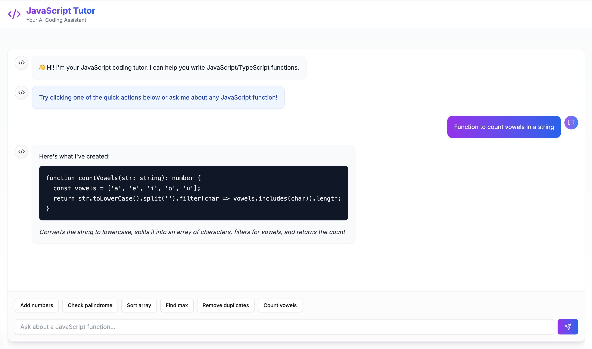

# JavaScript Tutor - AI Coding Assistant

A full-stack application that helps users learn JavaScript/TypeScript by generating and explaining code examples. Built with Next.js, FastAPI, and Claude AI.

![JavaScript Tutor Screenshot]

## Project Structure

```
javascript-tutor/
├── frontend/src               # Next.js frontend application
│   ├── app/                  # Next.js app directory
│   ├── components/           # React components
│   └── package.json          # Frontend dependencies
├── backend/                  # Python FastAPI backend
│   ├── app/                 # Main application package
│   │   ├── __init__.py
│   │   ├── main.py         # FastAPI app initialization
│   │   ├── api/           # API endpoints
│   │   │   ├── __init__.py
│   │   │   └── routes.py
│   │   ├── core/          # Core configurations
│   │   │   ├── __init__.py
│   │   │   ├── config.py
│   │   │   └── constants.py
│   │   ├── models/        # Data models
│   │   │   ├── __init__.py
│   │   │   └── schemas.py
│   │   └── services/      # Business logic
│   │       ├── __init__.py
│   │       └── ai_service.py
│   ├── run.py             # Application entry point
│   └── requirements.txt    # Python dependencies
├── .env                    # Environment variables
└── README.md              # This file
```

## Features

- 🤖 AI-powered JavaScript/TypeScript code generation
- 💡 Instant code explanations
- ⚡ Quick action suggestions
- 🎨 Modern, responsive UI
- 💻 Syntax-highlighted code blocks
- ✨ Real-time interaction        

## Prerequisites

- Node.js (v18 or higher)
- Python (3.8 or higher)
- Anthropic API key

## Setup & Installation

1. Clone the repository:
```bash
git clone https://github.com/yourusername/javascript-tutor.git
cd javascript-tutor
```

2. Create and set up environment variables:
```bash
# Create .env file in root directory
touch .env

# Add your Anthropic API key
echo "ANTHROPIC_API_KEY=your_api_key_here" >> .env
```

3. Set up the frontend:
```bash
# Navigate to frontend directory
cd frontend

# Install dependencies
npm install

# Install required UI components
npx shadcn-ui@latest init
npx shadcn-ui@latest add card button input scroll-area
```

4. Set up the backend:
```bash
# Navigate to backend directory from root
cd backend

# Create and activate virtual environment (optional but recommended)
python -m venv venv
source venv/bin/activate  # On Windows: venv\Scripts\activate

# Install dependencies
pip install -r requirements.txt
```

## Running the Application

1. Start the backend server:
```bash
# From the root directory
cd backend
python main.py
# Server will start at http://localhost:8000
```

2. Start the frontend development server:
```bash
# From the root directory
cd frontend
npm run dev
# Application will be available at http://localhost:3000

```
## Backend Structure
```bash
app/main.py: FastAPI application initialization and CORS configuration
app/api/routes.py: API endpoints for code generation
app/core/config.py: Configuration management and environment variables
app/core/constants.py: System prompts and constants
app/models/schemas.py: Pydantic models for request/response
app/services/ai_service.py: AI service for code generation
run.py: Application entry point
```

## API Endpoints

### POST `/api/generate`
Generates JavaScript/TypeScript code based on user prompt.

Request body:
```json
{
    "prompt": "Write a function to add two numbers"
}
```

Response:
```json
{
    "code": "function add(a: number, b: number): number {\n  return a + b;\n}",
    "explanation": "Adds two numbers and returns their sum"
}
```

### GET `/health`
Health check endpoint.

Response:
```json
{
    "status": "healthy"
}
```

## Development Commands

From root directory:

```bash
# Start backend
cd backend && python run.py

# Start frontend
cd frontend && npm run dev

# Install frontend dependencies
cd frontend && npm install

# Update UI components
cd frontend && npx shadcn-ui@latest add card button input scroll-area
```

## Environment Variables

Create a `.env` file in the root directory with the following:

```env
ANTHROPIC_API_KEY=your_api_key_here
```

## Tech Stack

Frontend:
- Next.js 14
- TypeScript
- Tailwind CSS
- shadcn/ui
- Lucide Icons

Backend:
- FastAPI
- Python
- Anthropic Claude API
- uvicorn


## License

This project is licensed under the MIT License - see the LICENSE file for details.

## Troubleshooting

1. **API Key Issues**:
   - Ensure `.env` file is in the root directory
   - Check if the API key is valid
   - Make sure the environment variable is being loaded correctly

2. **CORS Issues**:
   - Check if frontend URL matches the allowed origins in backend
   - Default development URLs are configured correctly

3. **Dependencies**:
   - Run `npm install` in frontend directory for any missing packages
   - Run `pip install -r requirements.txt` in backend directory if provided


